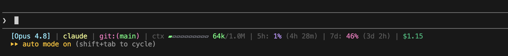

# status-line

A configurable status-line HUD for [Claude Code](https://claude.com/claude-code):
model, project, git, a context-usage bar, and rate-limit windows - rendered on one
line (or expanded to several). Pure Python, standard library only, no dependencies.

```
[Opus 4.8] claude git:(main*) ctx ▰▰▱▱▱▱▱▱▱▱ 86k/1.0M 17% | 5h: 6% (2h 17m) | 7d: 44% (3d 6h)
```



## Install

From within Claude Code, with this marketplace added:

```text
/plugin install status-line
/status-line:setup
```

`setup` picks the best available Python runtime (uv → `python -m venv` + pip →
system Python), wires the `statusLine` command into your `settings.json` (backing
up the existing one first), seeds a starter config, and shows a preview. Restart
Claude Code afterward so the new status line loads.

Requires Python 3.8+ **or** [uv](https://docs.astral.sh/uv/) on your PATH.

## Features

- Model and project context at a glance.
- Git branch, dirty state, ahead/behind counts, and optional file stats.
- Context window usage with selectable progress-bar styles.
- 5-hour and 7-day rate-limit windows with reset countdowns.
- Optional cost, duration, and line-change session details.
- Compact one-line layout or expanded multi-line layout.
- Themes, custom colors, custom labels, and partial config overrides.
- Fail-silent runtime behavior so prompt rendering is never interrupted by a
  traceback.

## Configure

```text
/status-line:configure
```

Or edit the config file directly - it is **deep-merged over the built-in
defaults**, so you only set the keys you want to change:

```
$CLAUDE_CONFIG_DIR/plugins/status-line/config.json   (~/.claude/... by default)
```

The authoritative list of options, themes, and presets lives in
[`src/hud/config.py`](src/hud/config.py) (`DEFAULTS`, `THEMES`, `PRESETS`).

### Options Reference

Top-level options:

| Key | Values / type | What it controls |
|-----|---------------|------------------|
| `layout` | `compact`, `expanded` | One-line output or one segment per line. |
| `separator` | string | Text between compact segments. Default: space, pipe, space. |
| `theme` | `default`, `nord`, `dracula`, `gruvbox`, `mono` | Base color theme. |
| `pathLevels` | number | Directory levels shown in the project segment. |
| `segments` | array | Segment order. Known segments: `model`, `project`, `git`, `context`, `usage`, `cost`, `session`. Omit a segment to hide it. |
| `colors` | object | Per-role color overrides applied on top of the active theme. |
| `customBarFilled` | string or `null` | Overrides the filled glyph for standard bar styles. |
| `customBarEmpty` | string or `null` | Overrides the empty glyph for standard bar styles. |

Model options:

| Key | Values / type | What it controls |
|-----|---------------|------------------|
| `model.format` | `short`, `full` | `short` trims the leading `Claude ` and parenthetical details; `full` uses the raw display name. |
| `model.brackets` | boolean | Wraps the model name in brackets, for example `[Opus 4.8]`. |

Context options:

| Key | Values / type | What it controls |
|-----|---------------|------------------|
| `context.label` | string | Label before the context usage, default `ctx`. |
| `context.value` | `tokens`, `percent`, `both`, `none` | Shows token count, percent, both, or hides the value. |
| `context.bar` | boolean | Shows or hides the context progress bar. |
| `context.barStyle` | bar style | Progress-bar style. See [Bar Styles](#bar-styles). |
| `context.barWidth` | number | Width of the context progress bar. |
| `context.warnThreshold` | number | Percent where context color changes to warning. |
| `context.critThreshold` | number | Percent where context color changes to critical. |

Usage-window options:

| Key | Values / type | What it controls |
|-----|---------------|------------------|
| `usage.windows` | array | Windows to show. Supported windows: `5h`, `7d`. |
| `usage.labels` | object | Renames usage windows, for example `{ "7d": "weekly" }`. |
| `usage.value` | `percent`, `remaining` | Shows used percent or remaining percent. |
| `usage.bar` | boolean | Shows or hides usage progress bars. |
| `usage.barStyle` | bar style | Progress-bar style. See [Bar Styles](#bar-styles). |
| `usage.barWidth` | number | Width of usage progress bars. |
| `usage.showReset` | boolean | Shows or hides the reset countdown. |
| `usage.resetFormat` | `relative`, `absolute` | Reset time display, for example `2h 17m` or `14:30`. |
| `usage.warnThreshold` | number | Percent where usage color changes to warning. |
| `usage.critThreshold` | number | Percent where usage color changes to critical. |

Git options:

| Key | Values / type | What it controls |
|-----|---------------|------------------|
| `git.show` | boolean | Enables or disables the git segment. |
| `git.showDirty` | boolean | Adds `*` when the worktree is dirty. |
| `git.showAheadBehind` | boolean | Shows ahead/behind counts. |
| `git.showFileStats` | boolean | Shows modified, added, deleted, and untracked counts. |
| `git.wrap` | `[prefix, suffix]` | Text around the branch name. Default: `["git:(", ")"]`. |

Cost and session options:

| Key | Values / type | What it controls |
|-----|---------------|------------------|
| `cost.label` | string | Prefix for the cost segment. Default: `$`. |
| `session.showDuration` | boolean | Shows session duration when available. |
| `session.showLines` | boolean | Shows added/removed line counts when available. |

### Bar Styles

Use these values for `context.barStyle` or `usage.barStyle`:

| Style | Filled / empty |
|-------|----------------|
| `rounded` | `▰` / `▱` |
| `blocks` | `█` / `░` |
| `shade` | `█` / `▒` |
| `bars` | `▮` / `▯` |
| `dots` | `●` / `○` |
| `line` | `━` / `─` |
| `equals` | `=` / `-`, wrapped in brackets |
| `hash` | `#` / `.`, wrapped in brackets |
| `ascii` | `#` / `-`, wrapped in brackets |
| `arrows` | `►` / `─` |
| `smooth` | fractional block bar |
| `braille` | braille block bar |

Run `status-line --styles` to preview them in your terminal.

### Themes And Colors

Built-in themes:

```text
default, nord, dracula, gruvbox, mono
```

Set `"theme"` for the base palette, then override individual roles under
`"colors"`. Color specs can be named colors (`green`, `brightMagenta`, `gray`),
256-color indexes (`208`), hex colors (`#ff8800`), or `+`-joined styles such as
`yellow+underline`.

Color roles:

```text
model, project, gitLabel, gitBranch, label, separator, value, valueDim,
barEmpty, contextOk, contextWarn, contextCrit, cost, session, linesAdded,
linesRemoved, 5h, 7d, usageWarn, usageCrit
```

Text styles:

```text
bold, dim, faint, italic, underline, blink, reverse, strike
```

### Presets

| Preset | What it enables |
|--------|-----------------|
| `minimal` | `model` + `context`, with context shown as percent. |
| `essential` | Default set: `model`, `project`, `git`, `context`, `usage`. |
| `full` | Adds `cost`, `session`, context `both`, git file stats, duration, and line counts. |

### Example Config

User config is partial. This is enough to switch theme, show context percent,
and relabel the weekly usage window:

```json
{
  "theme": "nord",
  "context": {
    "value": "both",
    "barStyle": "smooth"
  },
  "usage": {
    "labels": {
      "7d": "weekly"
    }
  }
}
```

## Preview

Run the non-installed previews from the `plugins/status-line` directory:

```bash
# installed console script
status-line --demo
# or, no install, any Python 3.8+
python3 src/statusline.py --demo
# preview a specific config file
status-line --demo --config /path/to/config.json
# list bar styles
status-line --styles
```

The HUD reads Claude Code's status-line JSON payload on stdin; `--demo` renders
sample data instead. It is fail-silent by design - any error prints a blank line
rather than crashing your prompt.

## Develop

Create a local environment:

```bash
cd plugins/status-line
python3 -m venv .venv
source .venv/bin/activate
# Windows (PowerShell): .venv\Scripts\Activate.ps1
pip install -e ".[dev]"
```

Run tests and quality checks:

```bash
python3 -m unittest discover -s tests
ruff check .
ruff format --check .
```

The runtime package is intentionally small:

| Module | Responsibility |
| ------ | -------------- |
| `hud/cli.py` | CLI entry point, demo payload, stdin handling |
| `hud/data.py` | Tolerant parsing of Claude Code status-line JSON |
| `hud/config.py` | Defaults, themes, presets, config loading |
| `hud/render.py` | Segment composition, truncation, per-segment isolation |
| `hud/colors.py` | ANSI color parsing, control-character stripping |
| `hud/bars.py` | Progress bar styles |
| `hud/gitinfo.py` | Best-effort git status probing |

See the repository [architecture guide](../../docs/ARCHITECTURE.md) for broader
maintainer guidance.

## Troubleshooting

- Run `python3 src/statusline.py --demo` to check whether the renderer works
  outside Claude Code.
- Run `python3 src/statusline.py --styles` to confirm the installed runtime is
  the expected version.
- Re-run `/status-line:setup` after plugin updates so the stable runtime under
  `$CLAUDE_CONFIG_DIR/plugins/status-line/.venv` is refreshed.
- If output is blank, temporarily preview with `--demo --config /path/to/config`
  and check whether the config file is valid JSON.

## License

MIT
